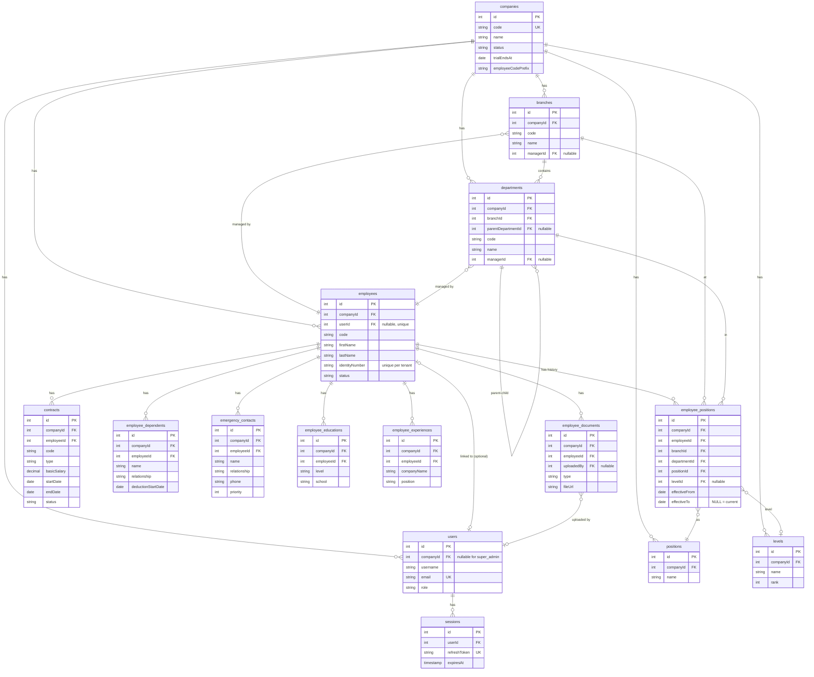

# HRM Database Schema

> Tài liệu này mô tả toàn bộ schema database HRM (31 bảng): cấu trúc cột, ràng buộc, quan hệ, ER diagram. Cập nhật theo tiến độ sprint. Sprint plan: xem [PLAN.md](PLAN.md).

**Legend:**
- 🟢 Sprint 0 (done)
- 🟡 Sprint 1 (đang design/build)
- ⚪ Sprint 2/3/4 (chưa detail, chỉ liệt kê tên + mục đích)

---

## 1. Tổng quan

**Kiến trúc:** Multi-tenant, shared DB, shared schema. Isolate bằng cột `companyId` per row + PostgreSQL Row-Level Security ở Sprint 4.

| Loại | Số bảng | Đặc điểm |
|---|---|---|
| Global | 6 | Không có `companyId`. Dùng chung mọi tenant. |
| Per-tenant | 25 | Có `companyId` NOT NULL. Isolate. |
| **Tổng** | **31** | |

**Quy ước chung:**
- PK: `id INT AUTO_INCREMENT`
- Mọi bảng có `createdAt`, `updatedAt` TIMESTAMP (Sequelize `timestamps: true`)
- Table name: snake_case số nhiều (`users`, `employee_positions`)
- Column name: camelCase (`companyId`, `firstName`)
- FK: `{referenced}Id` (VD: `companyId` → `companies.id`)
- Cascade delete: cascade `companyId` FK — xóa company thì xóa mọi data tenant. FK khác cascade nếu là "con" của record đó.

---

## 2. Danh mục bảng

| Sprint | Module | Bảng | Số | Status |
|---|---|---|---|---|
| S0 | Auth (global) | `companies`, `users`, `sessions` | 3 | 🟢 |
| S3 | Payroll ref (global) | `insurance_rates`, `tax_brackets`, `personal_deduction_rates` | 3 | ⚪ |
| S1 | Organization | `branches`, `departments`, `positions`, `levels` | 4 | 🟡 |
| S1 | Employee | `employees`, `employee_positions`, `contracts`, `employee_dependents`, `emergency_contacts`, `employee_educations`, `employee_experiences`, `employee_documents` | 8 | 🟡 |
| S2 | Attendance | `shifts`, `work_schedules`, `attendances` | 3 | ⚪ |
| S2 | Leave | `leave_types`, `leave_balances`, `leave_requests` | 3 | ⚪ |
| S3 | Payroll | `salary_structures`, `allowances`, `employee_allowances`, `payrolls`, `payroll_items` | 5 | ⚪ |
| S4 | Cross-cutting | `notifications`, `audit_logs`, `company_configs` | 3 | ⚪ |
| | **Tổng** | | **31** | |

---

## 3. Global tables (không có `companyId`)

### 3.1 `companies` 🟢

| Cột | Kiểu | Null | Default | Mô tả |
|---|---|---|---|---|
| id | INT PK | | auto | |
| code | VARCHAR(50) | ❌ | | Slug URL — path & subdomain (VD: `fpt`). Regex `^[a-z0-9-]{2,50}$`. **UNIQUE global** |
| name | VARCHAR(255) | ❌ | | Tên công ty |
| taxCode | VARCHAR(20) | ✓ | | MST doanh nghiệp |
| address | TEXT | ✓ | | Địa chỉ HQ |
| contactEmail | VARCHAR(255) | ✓ | | |
| contactPhone | VARCHAR(20) | ✓ | | |
| status | VARCHAR(20) | ❌ | `trial` | `trial` \| `active` \| `suspended` |
| trialEndsAt | DATE | ✓ | | +14 ngày kể từ signup |
| employeeCodePrefix | VARCHAR(10) | ✓ | | VD: "FPT" — dùng gen mã NV |
| createdAt / updatedAt | TIMESTAMP | ❌ | | |

**Ràng buộc:** UNIQUE `code`.

### 3.2 `users` 🟢

| Cột | Kiểu | Null | Default | Mô tả |
|---|---|---|---|---|
| id | INT PK | | auto | |
| companyId | INT FK → `companies.id` | ✓ | | NULL nếu `role='super_admin'`. Non-NULL cho tenant users. CASCADE. |
| username | VARCHAR(50) | ❌ | | UNIQUE per tenant (`companyId, username`) |
| hashedPassword | VARCHAR | ❌ | | bcrypt hash. Exclude default scope; dùng `.scope('withPassword')` |
| email | VARCHAR(255) | ❌ | | **UNIQUE global** |
| firstName | VARCHAR(100) | ❌ | | |
| lastName | VARCHAR(100) | ❌ | | |
| displayName | VARCHAR(200) | ❌ | | Auto compute `lastName + firstName` |
| role | VARCHAR(20) | ❌ | `employee` | `super_admin` \| `admin` \| `hr` \| `manager` \| `employee` |
| avatarUrl | VARCHAR | ✓ | | |
| phone | VARCHAR(20) | ✓ | | |
| isActive | BOOLEAN | ❌ | `true` | |
| createdAt / updatedAt | TIMESTAMP | ❌ | | |

**Ràng buộc:**
- UNIQUE `email` (global)
- UNIQUE composite (`companyId`, `username`)
- FK `companyId` → `companies.id` ON DELETE CASCADE
- Hook validate: `super_admin` ↔ `companyId = NULL`; role khác ↔ `companyId NOT NULL`

### 3.3 `sessions` 🟢

| Cột | Kiểu | Null | Mô tả |
|---|---|---|---|
| id | INT PK | | |
| userId | INT FK → `users.id` | ❌ | CASCADE |
| refreshToken | VARCHAR(255) | ❌ | UNIQUE. Hex 64 bytes. |
| expiresAt | TIMESTAMP | ❌ | +14 ngày kể từ tạo |
| createdAt / updatedAt | TIMESTAMP | ❌ | |

**Index:** `userId`, `refreshToken`, `expiresAt`.

### 3.4 `insurance_rates` ⚪ (Sprint 3)
Tỷ lệ đóng BHXH/BHYT/BHTN theo năm. Cập nhật khi luật đổi.
Cột dự kiến: `year`, `bhxhEmployee`, `bhytEmployee`, `bhtnEmployee`, `bhxhCompany`, `bhytCompany`, `bhtnCompany`, `effectiveFrom`, `effectiveTo`.

### 3.5 `tax_brackets` ⚪ (Sprint 3)
7 bậc thuế TNCN VN: 5% / 10% / 15% / 20% / 25% / 30% / 35%.
Cột: `bracket`, `fromAmount`, `toAmount`, `rate`, `effectiveFrom`, `effectiveTo`.

### 3.6 `personal_deduction_rates` ⚪ (Sprint 3)
Mức giảm trừ bản thân (11tr/tháng) + người phụ thuộc (4.4tr/tháng).
Cột: `selfDeduction`, `dependentDeduction`, `effectiveFrom`, `effectiveTo`.

---

## 4. Organization tables (Sprint 1) 🟡

Mọi bảng có `companyId INT NOT NULL FK → companies.id CASCADE`.

### 4.1 `branches` — Chi nhánh

| Cột | Kiểu | Null | Mô tả |
|---|---|---|---|
| id | INT PK | | |
| companyId | INT FK | ❌ | |
| code | VARCHAR(20) | ❌ | Mã chi nhánh (HN, HCM, DN). UNIQUE `(companyId, code)` |
| name | VARCHAR(255) | ❌ | "FPT Software Hà Nội" |
| address | TEXT | ✓ | |
| phone | VARCHAR(20) | ✓ | |
| email | VARCHAR(255) | ✓ | |
| managerId | INT FK → `employees.id` | ✓ | Trưởng chi nhánh. Set sau (circular ref) |
| isActive | BOOLEAN | ❌ | Default `true` |
| createdAt / updatedAt | TIMESTAMP | ❌ | |

### 4.2 `departments` — Phòng ban (self-ref cây)

| Cột | Kiểu | Null | Mô tả |
|---|---|---|---|
| id | INT PK | | |
| companyId | INT FK | ❌ | |
| branchId | INT FK → `branches.id` | ❌ | Thuộc chi nhánh nào |
| parentDepartmentId | INT FK self | ✓ | NULL = phòng gốc; non-NULL = phòng con |
| code | VARCHAR(20) | ❌ | HR, IT, FIN. UNIQUE `(companyId, code)` |
| name | VARCHAR(255) | ❌ | |
| description | TEXT | ✓ | |
| managerId | INT FK → `employees.id` | ✓ | Trưởng phòng |
| isActive | BOOLEAN | ❌ | Default `true` |

**Ràng buộc:** UNIQUE `(companyId, code)`. Business rule: `parentDepartmentId` phải cùng `companyId` (validate ở service).

### 4.3 `positions` — Chức danh

| Cột | Kiểu | Null | Mô tả |
|---|---|---|---|
| id | INT PK | | |
| companyId | INT FK | ❌ | |
| code | VARCHAR(20) | ✓ | UNIQUE `(companyId, code)` khi có |
| name | VARCHAR(255) | ❌ | "Senior Software Engineer", "Kế toán trưởng" |
| description | TEXT | ✓ | |
| isActive | BOOLEAN | ❌ | Default `true` |

### 4.4 `levels` — Cấp bậc

| Cột | Kiểu | Null | Mô tả |
|---|---|---|---|
| id | INT PK | | |
| companyId | INT FK | ❌ | |
| code | VARCHAR(20) | ✓ | |
| name | VARCHAR(100) | ❌ | Intern / Junior / Middle / Senior / Lead / Manager / Director |
| rank | INT | ❌ | Thứ tự sort. UNIQUE `(companyId, rank)` |
| description | TEXT | ✓ | |

---

## 5. Employee tables (Sprint 1) 🟡

Mọi bảng có `companyId INT NOT NULL FK → companies.id CASCADE`.

### 5.1 `employees` — Hồ sơ nhân viên (bảng chính, dày cột)

#### Cột PK / FK / định danh
| Cột | Kiểu | Null | Mô tả |
|---|---|---|---|
| id | INT PK | | |
| companyId | INT FK | ❌ | |
| userId | INT FK → `users.id` | ✓ | 1-1 với user. NULL = NV không có tài khoản. **UNIQUE** khi non-NULL |
| code | VARCHAR(20) | ❌ | Auto gen `{prefix}{NNN}` — FPT001. UNIQUE `(companyId, code)` |

#### Cột thông tin cá nhân
| Cột | Kiểu | Null | Mô tả |
|---|---|---|---|
| firstName | VARCHAR(100) | ❌ | Tên |
| lastName | VARCHAR(100) | ❌ | Họ |
| displayName | VARCHAR(200) | ❌ | Auto compute `lastName + firstName` |
| gender | VARCHAR(10) | ✓ | `male` \| `female` \| `other` |
| dateOfBirth | DATE | ✓ | |
| placeOfBirth | VARCHAR(255) | ✓ | |
| nationality | VARCHAR(50) | ✓ | Default `Việt Nam` |
| ethnicity | VARCHAR(50) | ✓ | Dân tộc |
| religion | VARCHAR(50) | ✓ | Tôn giáo |
| maritalStatus | VARCHAR(20) | ✓ | `single` \| `married` \| `divorced` \| `widowed` |

#### Cột giấy tờ tùy thân
| Cột | Kiểu | Null | Mô tả |
|---|---|---|---|
| identityNumber | VARCHAR(20) | ✓ | CCCD/CMND. **UNIQUE** `(companyId, identityNumber)` khi non-NULL |
| identityIssueDate | DATE | ✓ | Ngày cấp CCCD |
| identityIssuePlace | VARCHAR(255) | ✓ | Nơi cấp |
| taxCode | VARCHAR(20) | ✓ | MST cá nhân |
| socialInsuranceNumber | VARCHAR(20) | ✓ | Số BHXH |

#### Cột liên hệ
| Cột | Kiểu | Null | Mô tả |
|---|---|---|---|
| phone | VARCHAR(20) | ✓ | SĐT |
| personalEmail | VARCHAR(255) | ✓ | Email cá nhân (khác email login) |
| currentAddress | TEXT | ✓ | Địa chỉ hiện tại |
| permanentAddress | TEXT | ✓ | Địa chỉ thường trú |

#### Cột ngân hàng (cho payroll Sprint 3)
| Cột | Kiểu | Null | Mô tả |
|---|---|---|---|
| bankAccountNumber | VARCHAR(30) | ✓ | |
| bankAccountName | VARCHAR(200) | ✓ | Tên chủ TK |
| bankName | VARCHAR(100) | ✓ | Tên ngân hàng (Vietcombank, TPBank…) |
| bankBranch | VARCHAR(200) | ✓ | Chi nhánh ngân hàng |

#### Cột công việc
| Cột | Kiểu | Null | Default | Mô tả |
|---|---|---|---|---|
| joinedDate | DATE | ✓ | | Ngày vào công ty |
| status | VARCHAR(20) | ❌ | `probation` | `probation` \| `active` \| `on_leave` \| `terminated` |
| terminatedDate | DATE | ✓ | | Ngày nghỉ việc |
| terminatedReason | TEXT | ✓ | | Lý do nghỉ |
| avatarUrl | VARCHAR | ✓ | | |

**Composite indexes:** `(companyId, code)`, `(companyId, identityNumber)`, `(companyId, status)`, `(companyId, userId)`.

### 5.2 `employee_positions` — Lịch sử vị trí

| Cột | Kiểu | Null | Mô tả |
|---|---|---|---|
| id | INT PK | | |
| companyId | INT FK | ❌ | |
| employeeId | INT FK → `employees.id` | ❌ | CASCADE |
| branchId | INT FK → `branches.id` | ❌ | |
| departmentId | INT FK → `departments.id` | ❌ | |
| positionId | INT FK → `positions.id` | ❌ | |
| levelId | INT FK → `levels.id` | ✓ | |
| effectiveFrom | DATE | ❌ | Ngày bắt đầu |
| effectiveTo | DATE | ✓ | NULL = đang giữ vị trí này |
| note | TEXT | ✓ | Lý do chuyển |

**Business rule:** 1 employee chỉ có 1 record với `effectiveTo IS NULL` tại 1 thời điểm. Khi chuyển phòng: UPDATE record cũ set `effectiveTo`, INSERT record mới.

### 5.3 `contracts` — Hợp đồng lao động

| Cột | Kiểu | Null | Default | Mô tả |
|---|---|---|---|---|
| id | INT PK | | | |
| companyId | INT FK | ❌ | | |
| employeeId | INT FK | ❌ | | CASCADE |
| code | VARCHAR(50) | ❌ | | HD001/2026. UNIQUE `(companyId, code)` |
| type | VARCHAR(20) | ❌ | | `probation` (thử việc) \| `fixed_term` (xác định TH) \| `indefinite` (không XĐ TH) \| `seasonal` (mùa vụ) \| `collaboration` (CTV) |
| signedDate | DATE | ❌ | | Ngày ký |
| startDate | DATE | ❌ | | Ngày bắt đầu hiệu lực |
| endDate | DATE | ✓ | | NULL với `indefinite` |
| basicSalary | DECIMAL(15,2) | ❌ | | Mức lương thỏa thuận trong HĐ |
| allowanceAmount | DECIMAL(15,2) | ❌ | 0 | Tổng phụ cấp |
| workingHoursPerWeek | INT | ❌ | 40 | |
| probationEndDate | DATE | ✓ | | Nếu `type='probation'` |
| status | VARCHAR(20) | ❌ | `active` | `draft` \| `active` \| `expired` \| `terminated` |
| terminatedDate | DATE | ✓ | | |
| terminatedReason | TEXT | ✓ | | |
| fileUrl | VARCHAR | ✓ | | Link PDF hợp đồng scan |
| note | TEXT | ✓ | | |

**Business rule:** 1 employee chỉ có 1 contract `status='active'` tại 1 thời điểm.

### 5.4 `employee_dependents` — Người phụ thuộc (cho giảm trừ thuế TNCN)

| Cột | Kiểu | Null | Mô tả |
|---|---|---|---|
| id | INT PK | | |
| companyId | INT FK | ❌ | |
| employeeId | INT FK | ❌ | CASCADE |
| name | VARCHAR(200) | ❌ | Tên |
| relationship | VARCHAR(20) | ❌ | `child` \| `parent` \| `spouse` \| `other` |
| dateOfBirth | DATE | ✓ | |
| identityNumber | VARCHAR(20) | ✓ | CCCD người phụ thuộc |
| taxCode | VARCHAR(20) | ✓ | MST người phụ thuộc |
| deductionStartDate | DATE | ❌ | Bắt đầu tính giảm trừ |
| deductionEndDate | DATE | ✓ | NULL = vẫn giảm trừ |
| note | TEXT | ✓ | |

### 5.5 `emergency_contacts` — Người liên hệ khẩn cấp

| Cột | Kiểu | Null | Default | Mô tả |
|---|---|---|---|---|
| id | INT PK | | | |
| companyId | INT FK | ❌ | | |
| employeeId | INT FK | ❌ | | CASCADE |
| name | VARCHAR(200) | ❌ | | Tên người liên hệ |
| relationship | VARCHAR(100) | ❌ | | Free text: "Cha", "Mẹ", "Vợ", "Bạn thân"... |
| phone | VARCHAR(20) | ❌ | | SĐT chính |
| alternatePhone | VARCHAR(20) | ✓ | | SĐT phụ |
| address | TEXT | ✓ | | Địa chỉ |
| priority | INT | ❌ | 1 | Thứ tự ưu tiên liên hệ (1 = cao nhất) |
| note | TEXT | ✓ | | |

### 5.6 `employee_educations` — Trình độ học vấn

| Cột | Kiểu | Null | Mô tả |
|---|---|---|---|
| id | INT PK | | |
| companyId | INT FK | ❌ | |
| employeeId | INT FK | ❌ | CASCADE |
| level | VARCHAR(20) | ❌ | `primary` \| `secondary` \| `high_school` \| `vocational` (trung cấp) \| `associate` (cao đẳng) \| `bachelor` (đại học) \| `master` \| `doctorate` |
| school | VARCHAR(255) | ❌ | Tên trường |
| major | VARCHAR(255) | ✓ | Chuyên ngành |
| graduationYear | INT | ✓ | |
| gpa | DECIMAL(3,2) | ✓ | Điểm TB (VD 3.50/4.0) |
| note | TEXT | ✓ | |

### 5.7 `employee_experiences` — Kinh nghiệm làm việc trước

| Cột | Kiểu | Null | Mô tả |
|---|---|---|---|
| id | INT PK | | |
| companyId | INT FK | ❌ | |
| employeeId | INT FK | ❌ | CASCADE |
| companyName | VARCHAR(255) | ❌ | Công ty cũ |
| position | VARCHAR(255) | ❌ | Chức vụ |
| fromDate | DATE | ✓ | |
| toDate | DATE | ✓ | |
| description | TEXT | ✓ | Mô tả công việc |

### 5.8 `employee_documents` — Tài liệu upload

| Cột | Kiểu | Null | Mô tả |
|---|---|---|---|
| id | INT PK | | |
| companyId | INT FK | ❌ | |
| employeeId | INT FK | ❌ | CASCADE |
| type | VARCHAR(30) | ❌ | `cv` \| `identity_front` \| `identity_back` \| `contract` \| `diploma` \| `certificate` \| `other` |
| name | VARCHAR(255) | ❌ | Mô tả file |
| fileUrl | VARCHAR(500) | ❌ | Path/URL. Sprint 1: string thuần. Sau: R2 URL |
| fileSize | INT | ✓ | Bytes |
| mimeType | VARCHAR(100) | ✓ | |
| uploadedBy | INT FK → `users.id` | ✓ | Ai upload |

---

## 6. Sprint 2/3/4 tables — sẽ chi tiết khi tới

### 6.1 Attendance 🟡 (Sprint 2 — đang design)

**`shifts`** — Ca làm việc
| Cột | Kiểu | Mô tả |
|---|---|---|
| id, companyId | | |
| code | VARCHAR(20) | MORNING, EVENING, NIGHT |
| name | VARCHAR(100) | Ca sáng, Ca tối |
| startTime | TIME | 08:00 |
| endTime | TIME | 17:30 |
| breakMinutes | INT | 60 (nghỉ trưa) |
| isActive | BOOLEAN | |

**`work_schedules`** — Lịch làm việc gán NV
| Cột | Kiểu | Mô tả |
|---|---|---|
| id, companyId, employeeId, shiftId | | |
| effectiveFrom | DATE | |
| effectiveTo | DATE nullable | NULL = còn hiệu lực |

**`attendances`** — Chấm công
| Cột | Kiểu | Mô tả |
|---|---|---|
| id, companyId, employeeId | | |
| date | DATE | Composite unique `(companyId, employeeId, date)` |
| checkInAt / checkOutAt | TIMESTAMP nullable | |
| hoursWorked | DECIMAL(5,2) | Auto tính |
| otHours | DECIMAL(5,2) | Giờ vượt shift.endTime + tolerance 15p |
| status | VARCHAR(20) | `on_time` \| `late` \| `early_leave` \| `absent` \| `on_leave` \| `holiday` |
| lateMinutes, earlyMinutes | INT | |
| checkInIp | VARCHAR(45) | Audit |
| note | TEXT | |

### 6.2 Leave 🟡 (Sprint 2 — đang design)

**`leave_types`** — Loại phép
| Cột | Kiểu | Mô tả |
|---|---|---|
| id, companyId | | |
| code | VARCHAR(20) | ANNUAL, SICK, MATERNITY, MARRIAGE, BEREAVEMENT, UNPAID |
| name | VARCHAR(100) | Nghỉ phép năm... |
| daysPerYear | DECIMAL(4,1) nullable | 12 với annual, NULL = unlimited |
| isPaid | BOOLEAN | |
| requiresApproval | BOOLEAN | |
| color | VARCHAR(20) | Cho calendar view |
| isActive | BOOLEAN | |

**Auto seed 6 loại khi tạo tenant** — trong `authController.signupTenant` transaction.

**`leave_balances`** — Số phép còn lại
| Cột | Kiểu | Mô tả |
|---|---|---|
| id, companyId, employeeId, leaveTypeId | | |
| year | INT | 2026 |
| allocatedDays | DECIMAL(5,1) | Số cấp đầu năm |
| usedDays | DECIMAL(5,1) | Đã dùng |
| carriedOverDays | DECIMAL(5,1) default 0 | Carry over từ năm trước |

Composite unique `(employeeId, leaveTypeId, year)`.

**`leave_requests`** — Đơn xin nghỉ (workflow 2 stage)
| Cột | Kiểu | Mô tả |
|---|---|---|
| id, companyId, employeeId, leaveTypeId | | |
| fromDate, toDate | DATE | |
| halfDay | VARCHAR(20) nullable | NULL/`morning`/`afternoon` — cần fromDate=toDate |
| days | DECIMAL(4,1) | Auto tính dựa `companies.workingDays` |
| reason | TEXT | |
| status | VARCHAR(20) | `pending` \| `manager_approved` \| `approved` \| `rejected` \| `cancelled` |
| createdBy | INT FK → users.id | Ai submit |
| managerApprovedBy | INT FK → users.id nullable | |
| managerApprovedAt | TIMESTAMP nullable | |
| managerNote | TEXT nullable | |
| hrApprovedBy | INT FK → users.id nullable | |
| hrApprovedAt | TIMESTAMP nullable | |
| hrNote | TEXT nullable | |
| rejectedBy | INT FK → users.id nullable | Bất kỳ tầng nào reject |
| rejectedAt | TIMESTAMP nullable | |
| rejectedReason | TEXT nullable | |

### 6.3 Cập nhật `companies` (Sprint 2)
Thêm cột `workingDays` JSONB DEFAULT `{"mon":1,"tue":1,"wed":1,"thu":1,"fri":1,"sat":0,"sun":0}`
- Giá trị: `1` = ngày làm đủ, `0.5` = nửa ngày, `0` = nghỉ
- Dùng khi tính `leave_requests.days`

### 6.3 Payroll ⚪ (Sprint 3)
- **`salary_structures`** — cấu trúc lương versioned (NV × basicSalary × bhxhSalary × effectiveFrom-To)
- **`allowances`** — danh mục phụ cấp (ăn trưa, xăng xe, điện thoại…)
- **`employee_allowances`** — phụ cấp gán cho từng NV
- **`payrolls`** — bảng lương tháng (NV × month × year × gross × BH × thuế × net × status)
- **`payroll_items`** — chi tiết dòng lương (earning/deduction/insurance/tax)

### 6.4 Cross-cutting ⚪ (Sprint 4)
- **`notifications`** — thông báo in-app
- **`audit_logs`** — track thay đổi trên bảng nhạy cảm
- **`company_configs`** — key-value settings per tenant (SMTP, logo, feature flags)

---

## 7. ER Diagram (Sprint 0 + Sprint 1)

**Xem diagram:** Mở file này trong VSCode + cài extension "Markdown Preview Mermaid Support" (bierner.markdown-mermaid). Hoặc paste block Mermaid vào https://mermaid.live để xem trực quan.

---

## 8. Relationships summary — cấp cao

### Company ownership
- 1 `company` → nhiều `users`, `branches`, `departments`, `positions`, `levels`, `employees`, và mọi bảng per-tenant khác.
- Xóa `company` → CASCADE xóa tất cả data tenant.

### Organization hierarchy
- 1 `branch` → nhiều `departments`.
- 1 `department` có 0-1 `parentDepartment` (cùng `companyId`) → cho phép cây phòng ban đa cấp.

### Employee ↔ User
- Quan hệ **0-1 : 0-1** qua `employees.userId` (nullable, UNIQUE khi non-NULL).
- Case:
  - NV chưa cấp login: `employees.userId = NULL`
  - NV cấp login: `employees.userId → users.id`. User có `companyId = employee.companyId`, `role='employee'` (mặc định).
  - Admin đầu tiên (signup tenant): chỉ có `user`, chưa có `employee`. HR có thể tạo `employee` sau và link.

### Employee position history
- 1 `employee` có nhiều `employee_positions` (lịch sử).
- Vị trí hiện tại: record có `effectiveTo IS NULL`.
- Khi chuyển phòng/thăng chức: `UPDATE` record cũ set `effectiveTo = today`, `INSERT` record mới.

### Manager reference (circular)
- `branches.managerId` → `employees.id` (nullable) — trưởng chi nhánh.
- `departments.managerId` → `employees.id` (nullable) — trưởng phòng.
- Nullable vì tạo branch/department trước khi có NV. Set sau khi có NV được bổ nhiệm.

### Contract lifecycle
- 1 `employee` có nhiều `contracts` (lịch sử HĐ) nhưng **chỉ 1 `status='active'`** tại 1 thời điểm.
- HĐ hết hạn: `status = 'expired'`. Ký mới: INSERT record mới.

### Documents
- `employee_documents.fileUrl` — Sprint 1 lưu string thuần (paste URL).
- Sau: upload lên Cloudflare R2, path `uploads/{companyId}/employees/{employeeId}/documents/{filename}`.
- `uploadedBy` FK → `users.id` để track ai upload (nullable vì system-generated có thể không có user).

---

## 9. Business rules quan trọng

### Multi-tenant isolation
- Mọi query bảng per-tenant PHẢI có `WHERE companyId = <current tenant>`. Dùng helper `scopeToCompany(req)` ([backend/src/utils/tenant.js](backend/src/utils/tenant.js)).
- Sprint 4: bổ sung PostgreSQL Row-Level Security ở tầng DB làm defense-in-depth.

### Employee code auto gen
- Khi tạo `employee`: query MAX(code) hiện có của tenant + increment. Chạy trong transaction + `SELECT ... FOR UPDATE` lock để tránh race condition tạo trùng.
- Format: `{prefix}{NNN}` — nếu `employeeCodePrefix='FPT'` và max hiện tại là 002 → code mới = `FPT003`.

### Contract active tại 1 thời điểm
- Trước khi INSERT contract mới với `status='active'`: check nếu employee đã có active contract → hỏi HR (auto expire cái cũ? hay reject?). Chọn approach ở service.

### Employee_position không overlap
- Trước khi INSERT record mới: UPDATE các record cũ có `effectiveTo IS NULL` → set `effectiveTo = today`.
- Enforce ở service, không dùng DB constraint (phức tạp với range types).

### Employee status vs Contract status
- `employees.status` là trạng thái NV trong hệ thống HRM.
- `contracts.status` là trạng thái từng HĐ.
- Không auto sync. HR quản lý riêng.
- VD: NV có HĐ hết hạn (contract.status=expired) nhưng đang thương lượng gia hạn → employee.status vẫn là `active`.

### Cascade delete
- Xóa `companies` → CASCADE mọi bảng có `companyId`.
- Xóa `employees` → CASCADE `employee_positions`, `contracts`, `employee_dependents`, `emergency_contacts`, `employee_educations`, `employee_experiences`, `employee_documents`.
- Xóa `users` → CASCADE `sessions`. Không CASCADE ngược lên `employees.userId` — chỉ SET NULL (employees còn tồn tại dù user bị xóa).

### Payroll immutability (Sprint 3)
- `payrolls.status = 'finalized'` → không cho UPDATE trực tiếp. Muốn sửa → API `unlock` → về `draft` → sửa → finalize lại. Audit log ghi lại.

### Salary versioning (Sprint 3)
- `salary_structures` không UPDATE. Tăng lương = INSERT record mới với `effectiveFrom` mới. Record cũ set `effectiveTo`.

---

## 10. Chỉ mục & performance

Mọi bảng per-tenant nên có:
- **Composite index `(companyId, ...)`** cho các cột query phổ biến (VD: `(companyId, code)`, `(companyId, status)`)
- Không dùng single-column index trên cột nghiệp vụ mà không có `companyId` prefix — vì mọi query đều filter theo `companyId` trước.

**Ví dụ index cho `employees`:**
- `(companyId, code)` — lookup theo mã NV
- `(companyId, identityNumber)` — lookup theo CCCD
- `(companyId, status)` — filter danh sách theo trạng thái
- `(companyId, userId)` — lookup NV theo user login

---

## 11. Changelog

| Ngày | Sprint | Thay đổi |
|---|---|---|
| 2026-07-05 | S0 | Tạo `companies`, `users` (cập nhật thêm companyId + role super_admin), `sessions` |
| 2026-07-05 | S1 (planning) | Chốt schema 12 bảng Organization + Employee. Thêm `emergency_contacts`. |
